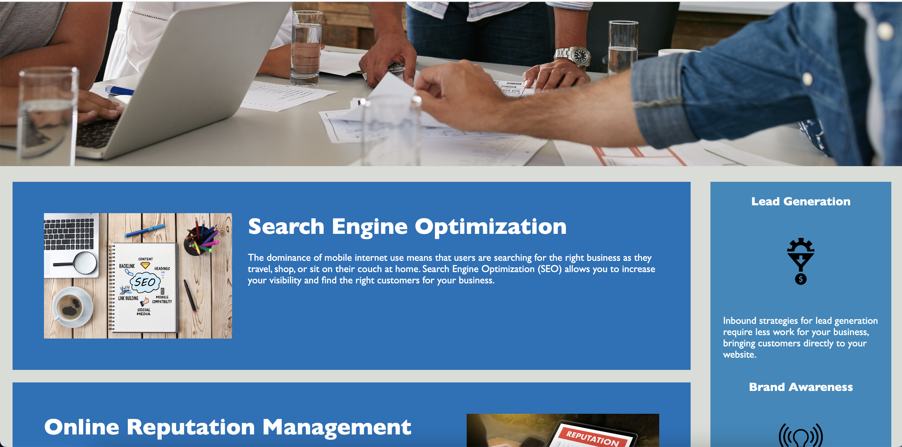
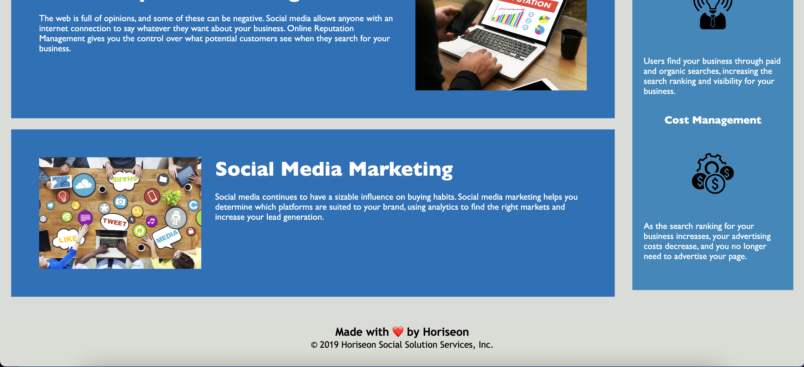

# Company website to learn basics of HTML & CSS

## Description
This project has HTML and CSS to for a company website. Purpose of this project is to learn basics of HTML and CSS, and more specifically learn following topics in detail -

1. Semantic HTML elements.
2. Logical structure of HTML elements.
3. Accessibility of image and icon elements.
4. Sequential ordering of heading attributes.
5. Consolidation and organization of CSS selectors.
6. CSS comments.
7. Professional Readme file best practices.

## Installation

N/A

## Usage

This website has following sections -
1. Header
2. Background image
3. Three Horizontal sections, each describing company's offerings.
4. Vertical section, explaining benefits of company's products.
5. Footer.

To see the HTML elements their structure and corressponding CSS styling, open the Chrome DevTools by pressing Command+Option+I (macOS) or Control+Shift+I (Windows). A console panel should open either below or to the side of the webpage in the browser.

To capture the image of the complete webpage, its screenshots are divided into three sections - top, middle and bottom.

Link of deployed application - 
https://mypooja.github.io/Bootcamp-week1-challenge/

## Credits

None

## License

Please refer to the LICENSE in the repo.